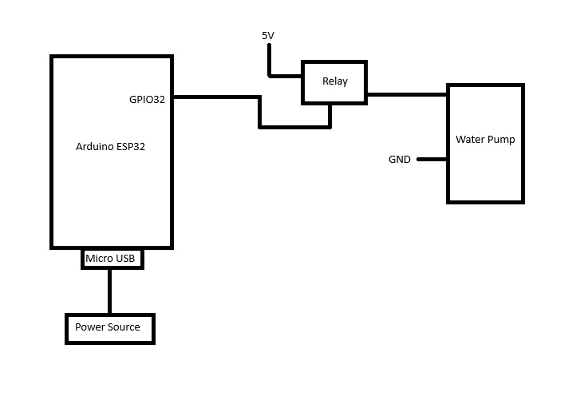
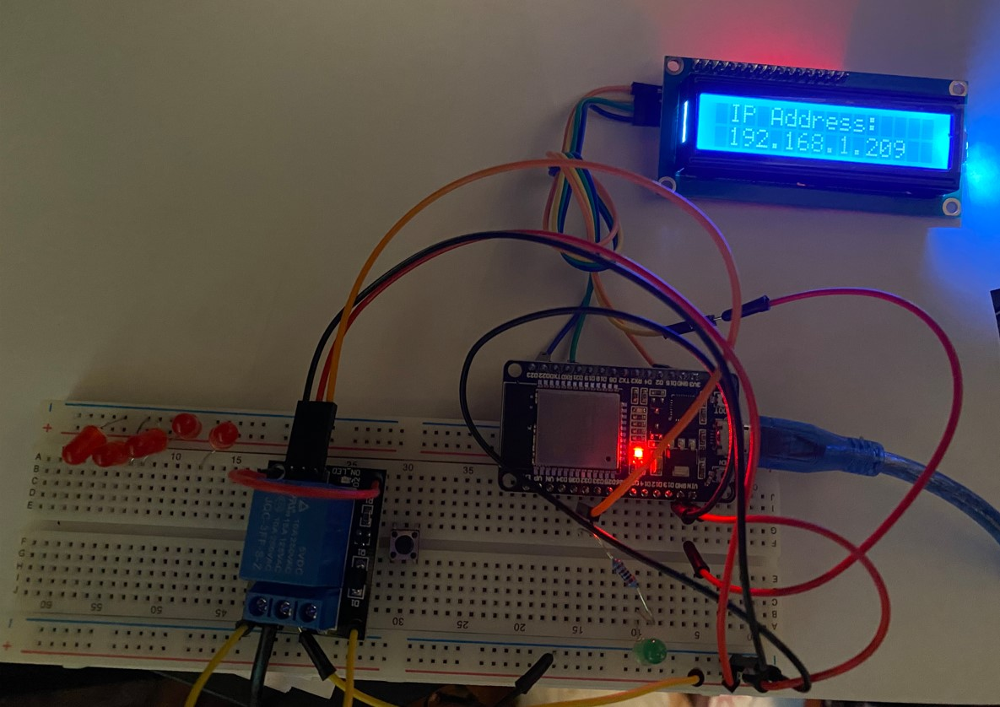

# RemoteWateringSystem
Remote Watering System based on Arduino ESP32

# Description 
This project utilizes the Arduino ESP32 Dev Module, and its primary goal is to provide remote plant watering functionality.

# Code 
The code was developed using <a href="https://www.arduino.cc/en/software"> Arduino IDE version 2.3.4 </a>, which was used to compile and upload the software onto the device.

# Third party libraries
The software utilizes the "LCD_I2C.h" library to control the LCD display over <a href="https://en.wikipedia.org/wiki/I%C2%B2C"> I2C Protocol </a>  
<a href="https://github.com/blackhack/LCD_I2C/tree/master">LCD_I2C GitHub Repo</a>

# Functional Description
The project is primarily built around an Arduino ESP32, mounted on a breadboard, and integrated with several additional components. 
See schematic below: 

# Hardware list

* <a href="https://www.amazon.com/ESP-WROOM-32-Development-Dual-Mode-Microcontroller-Integrated/dp/B07WCG1PLV/ref=sxin_16_pa_sp_search_thematic_sspa?content-id=amzn1.sym.c5787da2-212d-48eb-a894-9ea5a87adeb3%3Aamzn1.sym.c5787da2-212d-48eb-a894-9ea5a87adeb3&crid=34WWLQ6CSFA0L&cv_ct_cx=esp32+development+board&keywords=esp32+development+board&pd_rd_i=B07WCG1PLV&pd_rd_r=a813615e-8e34-44f5-a48e-beed27b44e4d&pd_rd_w=RPSvm&pd_rd_wg=tfmYF&pf_rd_p=c5787da2-212d-48eb-a894-9ea5a87adeb3&pf_rd_r=8AN6QZEBQPPJEACEND17&qid=1738774208&sbo=RZvfv%2F%2FHxDF%2BO5021pAnSA%3D%3D&sprefix=esp32%2Caps%2C174&sr=1-1-6024b2a3-78e4-4fed-8fed-e1613be3bcce-spons&sp_csd=d2lkZ2V0TmFtZT1zcF9zZWFyY2hfdGhlbWF0aWM&psc=1">Arduino ESP32 Dev Module</a>
* <a href="https://www.amazon.com/dp/B0BRQX6G3T?ref=ppx_yo2ov_dt_b_fed_asin_title">Breadboard 830 Point Solderless Prototype PCB Board </a>
* <a href="https://www.amazon.com/dp/B07TLRYGT1?ref=ppx_yo2ov_dt_b_fed_asin_title">5V Relay Module and Water Pump + 1M Vinyl Tubing</a>
* <a href="https://www.amazon.com/dp/B0C89Q81FW?ref=ppx_yo2ov_dt_b_fed_asin_title">Micro-USB Cable Fast Charging Cords Data Transfer Cable 30cm </a>
* <a href="https://www.amazon.com/dp/B0D2L9JHLD?ref=ppx_yo2ov_dt_b_fed_asin_title&th=1">1602 LCD Display Module with IIC I2C Serial Interface Adapter LCM Blue Backlight Screen AIP31066 Controller 16X2 LCD</a>

# Demo

  

